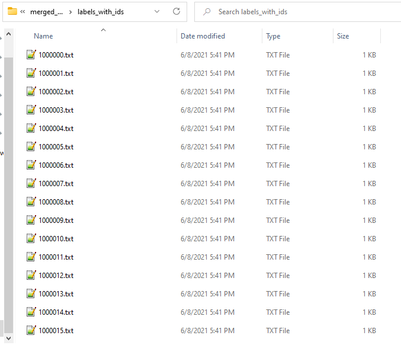
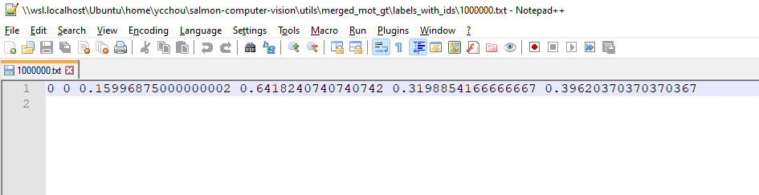
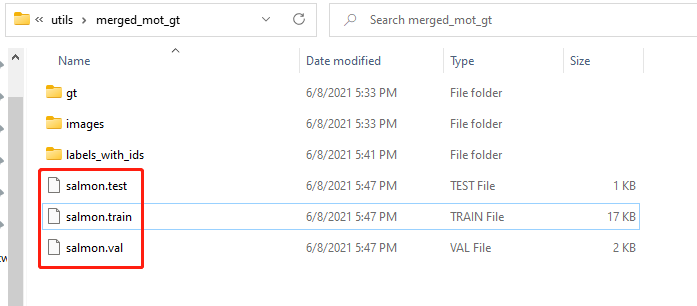
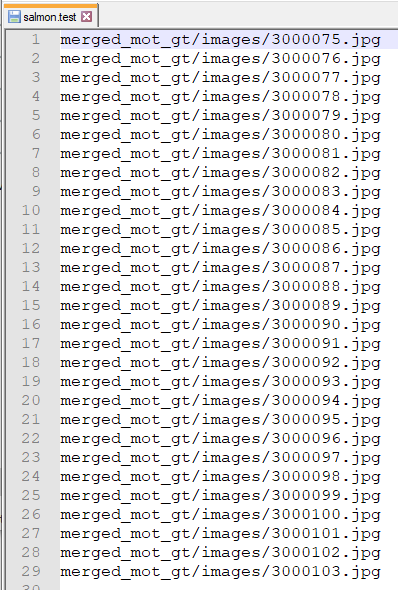

# Run the python script convert_gt_jde.py

After we have MOT Seq GT format annotations, we want to convert them to JDE format. Then, we want to split data into training, validation and test dataset.

## Convert to JDE format

To convert MOT Seq GT format to JDE format, we run this command:

```
convert_gt_jde.py convert {path to the merged mot gt folder}
```

An example of this command is:

```
python convert_gt_jde.py convert merged_mot_gt
```

After running the script, please go to the merged_mot_gt folder you have specified in the command, you will find a new folder created named labels_with_ids. The folder labels_with_ids contains JDE annotation files.




## Split JED annotations

After we have converted annotations to JDE format, we want to split the data into train, validation and test dataset. Run this command to split data:

```
python convert_gt_jde.py split {path to folder of JDE annotations}
```

Since the python script convert MOT Seq GT to JDE at the same location, the path to folder of JDE annotations will just be the same as merged_mot_gt. An example of the command is:

```
python convert_gt_jde.py split merged_mot_gt
```

After running the script, three new files will be generated. These files specify the training, validation and test dataset accordingly.



