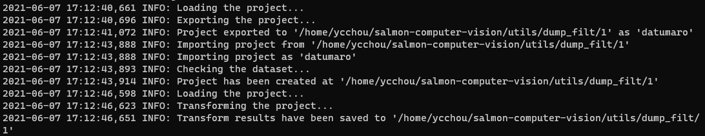

# Run download_frames.sh

## Install expect

This script will call script.exp script at the same folder, which will use expect. Therefore, we need to make sure we have installed it.

```
apt-get install expect
```

## Install datumaro

To install datumaro, run this command:

```
pip install datumaro
```

For installation requirements, please check datumaro's GitHub repository:

[openvinotoolkit/datumaro](https://github.com/openvinotoolkit/datumaro)

The script.exp will try to spawn a datumaro process, so we need to make sure we have installed datumaro.

## Install tensorflow

We also need tensorflow. Please make sure we have installed tensorflow.

```
pip install tensorflow
```

## Run download_frames.sh script

```
./download_frames.sh {username} {password} {path to source folder} {path to output folder} {optional: xpath filter}
```

An example of this command is:

```
./download_frames.sh username password dump dump_filt
```

**Note:** Make sure the output folder already exists in the file system.

After running the script, you should see the following messages if it is successful:



## Troubleshooting

### Failed to import transform.py ...

If the reason for failing to import transform.py is about numpy, please try to update numpy version to the latest one.
