# Run make_cvat_tasks.sh Script

The **make_cvat_tasks.sh** script can help us create CVAT tasks with labelled videos automatically. We need to supply with input videos and annotation files, and then CVAT tasks will be created. After that, we can go to CVAT server and dump those labelled annotations in other formats, or we can do any modification directly from CVAT.

## Install Go

To use drive command, we need to install Go.

[Download and install Go](https://golang.org/doc/install#install)

Add go bin to PATH:

```bash
cat << ! >> ~/.bashrc
> export PATH=\$PATH:/usr/local/go/bin
> !
source ~/.bashrc
```

Also, we want to set up the start script for go path:

```bash
mkdir ~/gopath

cat << ! >> ~/.bashrc
> export GOPATH=~/gopath
> export PATH=\$GOPATH:\$GOPATH/bin:\$PATH
> !
source ~/.bashrc # To reload the settings and get the newly set ones # Or open a fresh terminal
```

### ~/.bashrc

Every time we turn on WSL 2, this script will be run to set up system, including PATH variable. Therefore, we need to include PATH variable set up here so that we won't lose it next time we restart WSL 2.

## Drive Command

We need to install this drive tool and use this drive command to initialize Google Drive.

[GitHub Repository: odeke-em/drive](https://github.com/odeke-em/drive)

Install drive by running:

```bash
go get -u github.com/odeke-em/drive/cmd/drive 
```

Run this command to confirm that drive is installed:

```bash
drive version
```

To initialize drive:

```bash
drive init ~/gdrive
cd ~/gdrive
```

Note that right now there is no files in gdrive. There is only a hidden credential file.

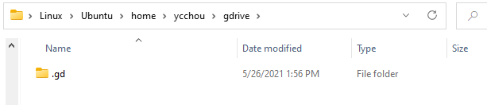

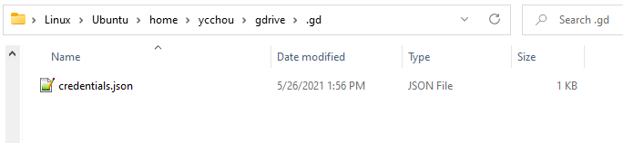
## Install CVAT

We will need to run some of CVAT's scripts later.

[GitHub Repository: openvinotoolkit/cvat](https://github.com/openvinotoolkit/cvat)

### Docker Desktop WSL 2 Backend

If you are using WSL 2, make sure Docker Desktop is running on WSL 2 instead of Hyper-V.

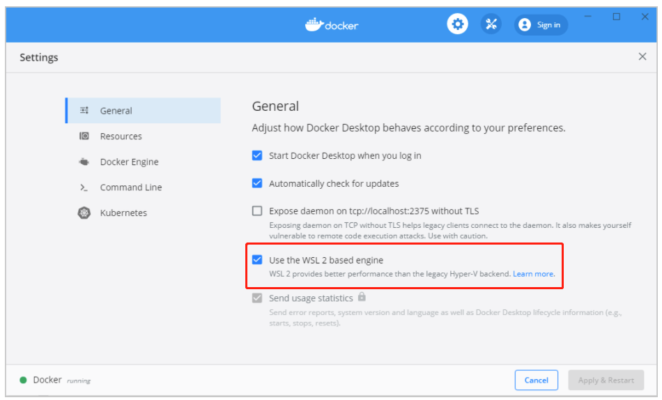

Also, make sure CVAT containers are built from WSL 2 side by running commands from WSL 2.

### Create **docker-compose.override.yml**

We need to create a **docker-compose.override.yml** file in the root folder of cvat repository with the following content because we want to mount ~/gdrive with cvant_share:

```yaml
version: '3.3'
services:
  cvat:
    environment:
      CVAT_SHARE_URL: 'Salmon dataset Gdrive'
    volumes:
      - cvat_share:/home/django/share:ro

volumes:
  cvat_share:
    driver_opts:
      type: none
      device: ~/gdrive
      o: bind
```

Please note that if you are using WSL 2, you may get an error message saying that the binding path does not exist. In this case, we need to modify docker-compose.override.yml file and do some manually copying. Please go to the **Troubleshooting** section and read **Failed to mount local volume: No such file or directory**.

### Create docker containers

After setting up docker-compose.override.yml file, we can create containers by running:

```bash
cd ~/cvat
docker-compose up -d
```

All containers should be up and running now.

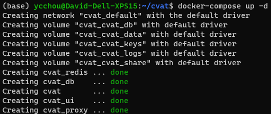

We can send GET request to CVAT and get response to test it. The requests must be sent with credentials. The credential token can be found by authorizing on [localhost:8080/api/swagger](http://localhost:8080/api/swagger) page.

## Get labels-converted.json

We already have labels-converted.json in our salmon-computer-vision repository at utils folder.

### To generate new labels-converted.json

If we have new labels, we will need to generate new labels-converted.json file.

Convert the **labels field of the XML file** to JSON and write it in labels.json file.

Then, run this command to convert labels:

```powershell
./jq-labels.sh labels.json > labels-converted.json
```

Note that jq is a Linux command, so we should run it on Linux environment or WSL 2.

## Get annotation folder ready

make_cvat_tasks.sh script will need to access annotation files. We need to git clone salmon-count-labels repository, which contains annotations:

[](https://github.com/KamiCreed/salmon-count-labels)

## Get salmon_list.txt ready

We will need salmon_list.txt, so the make_cvat_tasks.sh can find the input videos from Google Drive.

The salmon_list.txt contains a list of file path of input videos. These paths point to the path on Google Drive. This is an example of salmon_list.txt:

[salmon_list.txt](assets/run_make_cvat_tasks/salmon_list.txt)

## To generate new salmon_list.txt file

If we have new input videos or other files that we want to include, we need to generate a new salmon_list.txt file. To generate a new salmon_list.txt file, run this drive command:

```powershell
drive ls -recursive -files -no-prompt "Salmon Videos" > "salmon_list.txt"
```

Note that we do not need to trim salmon_list.txt if we only want to run few annotations because of the following lines:

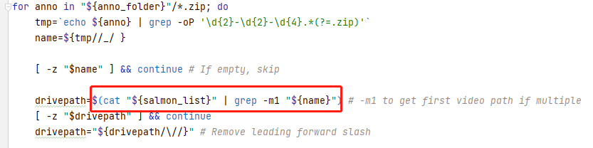

These lines will only look for the matched input videos according to the provided annotation files.

For example, if we only have one annotation file **07-15-2020_15-51-08_M_Left_Bank_Underwater.zip**, we do not need to alter salmon_list.txt to make it contain only the path of the input video.

### Place salmon_list.txt file on the root folder of your Google Drive

Since the script will try to access salmon_list.txt file at the root folder of your Google Drive (~/gdrive), we need to upload salmon_list.txt file to Google Drive root folder.

### drive pull salmon_list.txt

We need to run drive pull to download salmon_list.txt file on our local computer gdrive folder. Run this command to drive pull salmon_list.txt:

```powershell
cd ~/gdrive
drive pull salmon_list.txt
```

## Make sure Salmon Videos folder is at Google Drive root folder

The script assumes Salmon Videos folder is at your Google Drive folder. Therefore, we need to add Salmon Videos folder to our Google Drive root folder. Note that a shortcut does not work. We need to use **shift + z** to add Salmon Videos folder to our Google Drive root folder.

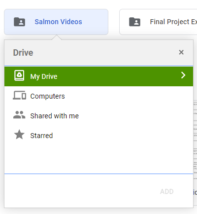

## Run make_cvat_tasks.sh

Run make_cvat_tasks.sh on Linux environment or WSL 2.

```powershell
./make_cvat_tasks.sh {path to cvat/utils/cli/cli.py} {cvat_username}:{cvat_password} {cvat host url(e.g. localhost)} {path to labels-converted.json} {path to annotation folder} {path to gdrive}
```

An example of this command:

```powershell
./make_cvat_tasks.sh ../../cvat/utils/cli/cli.py cvat_user:cvat_pwd localhost labels-converted.json ~/annotation ~/gdrive
```

After running the above command, you should see messages like this:

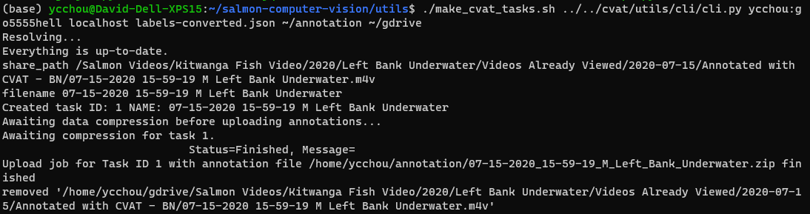

When all of tasks are done, you can go to cvat web interface by typing the following URL from Google Chrome:

```bash
http://localhost:8080/
```

Then, go to tasks page, and you will see a list of tasks created by the script:

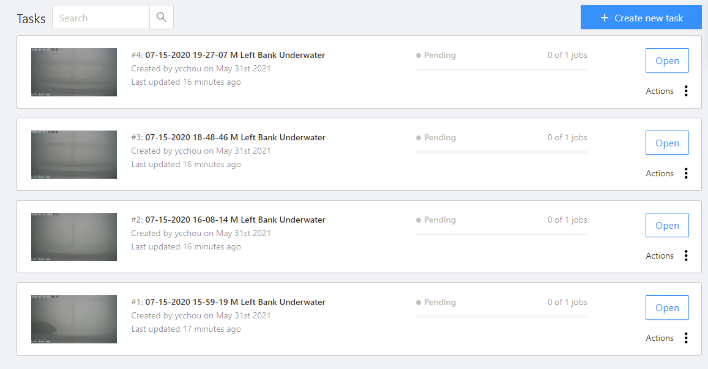

Open the tasks and you can see they are already labelled.

## Troubleshooting of make_cvat_tasks.sh

### No such file or directory: '/home/django/share/...

This path is on cvat container.

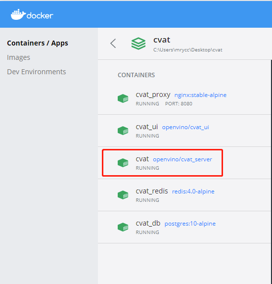

We need to mount our ~/gdrive to cvat_share. Make sure you have followed the **Create docker-compose.override.yml** step.

### Failed to mount local volume: No such file or directory

If you are using WSL 2, this section may be useful to you.

Looks like the volume mount point does not exist on WSL 2 Docker Desktop Integration. WSL 2 does not support binding WSL 2 local file system to docker containers. For example, we want to bind ~/gdrive on WSL 2 to cvat_share on cvat container. However, this will always fail when we try to build the container because docker will try to bind the path /var/lib/docker/volumes/cvat_cvat_share/_data, but this path does not exist.

WSL 2 maps /var/lib/docker/volumes/ to \\wsl$\docker-desktop-data\version-pack-data\community\docker\volumes. We need to use PowerShell from Windows system and cd to the following path to see files at the location of docker volumes.

```yaml
\\wsl$\docker-desktop-data\version-pack-data\community\docker\volumes>
```

[Locating data volumes in Docker Desktop (Windows)](https://stackoverflow.com/questions/43181654/locating-data-volumes-in-docker-desktop-windows/64418064)

[Docker volumes on WSL 2 using Docker Desktop](https://stackoverflow.com/questions/63552052/docker-volumes-on-wsl2-using-docker-desktop)

#### Workaround

First of all, we do not want to bind cvat_share in docker-compose.override.yml file. Please change the file to the following:

```yaml
version: '3.3'
services:
  cvat:
    environment:
      CVAT_SHARE_URL: 'Salmon dataset Gdrive'
    volumes:
      - cvat_share:/home/django/share:ro

volumes:
  cvat_share:
```

Note that we only want to declare cvat_share volume but we do not want to bind it.

After that, we need to manually copy the input videos to \\wsl$\docker-desktop-data\version-pack-data\community\docker\volumes\cvat_cvat_share\_data.

Firstly, we need to drive pull the input videos we will be using. Then, use Windows system and to go  the gdrive folder from Windows system, and then copy the entire input video folder.

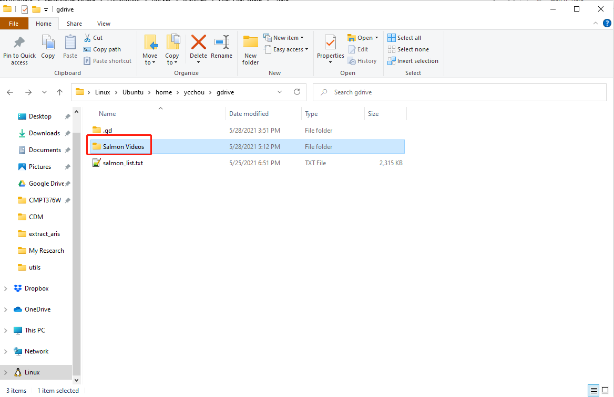

Then, paste the entire input videos folder to the volume location:

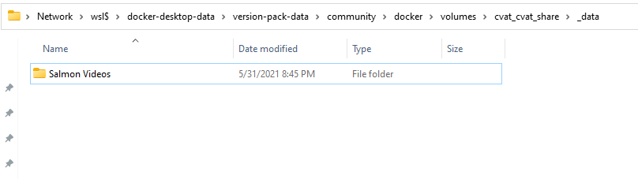

Then, the cvat container can access the input videos, and the problem is solved.