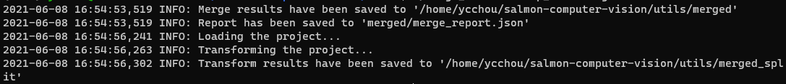

# Run merge_filt.sh

This script merges the dumped annotations from previous script and split them into training set, validation set and test set.

The command is:

```
./merge_filt.sh {path to source dump folder} {path to output folder}
```

An example of this command is:

```
./merge_filt.sh dump_filt merged
```

After running the script, you should see the following messages:



# Troubleshooting

## requires at least 2 arguments

```text
argparse.ArgumentTypeError: Argument 'project' requires at least 2 arguments
```

If you see this error message, it is likely that you only have one task folder in the source folder. Therefore, when you run this script, the script will try to run datum merge on a single task folder, which does not make sense.

If you only have one task folder, you do not need to merge it. You can skip to the next script.