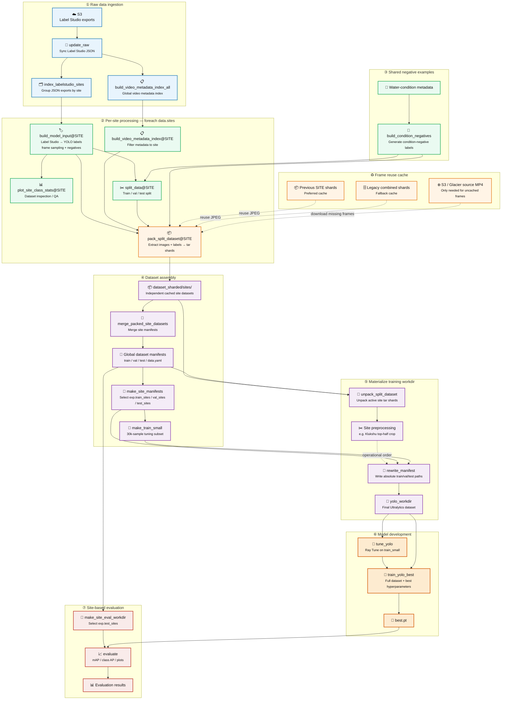

# Object Detection

Training pipeline to train the SalmonVision object detection model.

Install uv:
```bash
curl -LsSf https://astral.sh/uv/install.sh | sh
```

Install DVC with S3 support:
```bash
uv tool install "dvc[s3]"
```

Sync uv with appropriate python packages:
```bash
uv sync --extra cu124 --locked
```
Change `cu124` to `cu129` if the CUDA version is 12.9 on the system.

After this sync, remember to always either use the `--extra cu124` flag or use
`--no-sync`, so `uv` doesn't try to re-install torch with a newer version. Eg.

```bash
uv run --no-sync python
```

Install the object detection module in an editable state:
```bash
uv pip install -e .
```

### Dataset

Setup `aws` cli on the machine to point to the remote storage described in `.dvc/config`.

Run the following to pull data:
```
dvc pull
```

All the data will be downloaded to `data`.

`data/04_dataset/salmon_dataset/dataset_sharded/` has the full dataset packed into tar shards.

You can manually perform tar extract or run the unpack step:
```bash
dvc repro --single-item --force unpack_split_dataset
```

This will unpack the tar files and put them in `data/04_dataset/salmon_dataset/yolo_workdir/`

### Pipeline

Check dvc.yaml for the full pipeline.

Here is a visual describing all the components:



Run the following to run the entire pipeline:
```bash
dvc repro
```

Run the following to run specific stages of the pipeline:
```bash
dvc repro stage_name
```

This will still run previous stages up to the stage specified.

For example, building the model input annotations:
```bash
dvc repro build_model_input
```

If wanting to only run one stage, use the `--single-item` flag:
```bash
dvc repro --single-item build_model_input
```

Run tests with
```
uv run pytest
```

#### Issue: Object is of storage class GLACIER

This happens when the videos we are trying to download have been
archived into GLACIER storage. We can restore these temporarily
with the following bash script.

Capture the `repro` command into a logfile:

```
dvc repro pack_split_dataset 2>&1 | tee pack.log
```

Submit restore requests:
```
./scripts/restore_glacier_from_log.sh request pack.log
```

By default it will be BULK (5-12 hours process) and for 3 days.

Explicitly:
```bash
./scripts/restore_glacier_from_log.sh request pack.log 3 Bulk
```

Once the requests have been sent, use the same script to check the status:

```
./scripts/restore_glacier_from_log.sh status pack.log
```

The last line should say when all the objects are ready for download.

### Plot AP50 by site

To evaluate over all test sites, run the following command:

```bash
uv run --extra cu124 ./scripts/run_site_eval_experiments.py --queue --run-queue
```
Replace cu124 with your appropriate CUDA version if necessary.

Add `--dry-run` to test the command first.

They can be plotted after using
```bash
./scripts/plot-all-eval.sh "Full Model AP50"
```

This creates an HTML in `dvc_plots` with the plots.

Run a simple http server and connect to it through SSH tunnel
```bash
cd dvc_plots
python -m http.server
```
