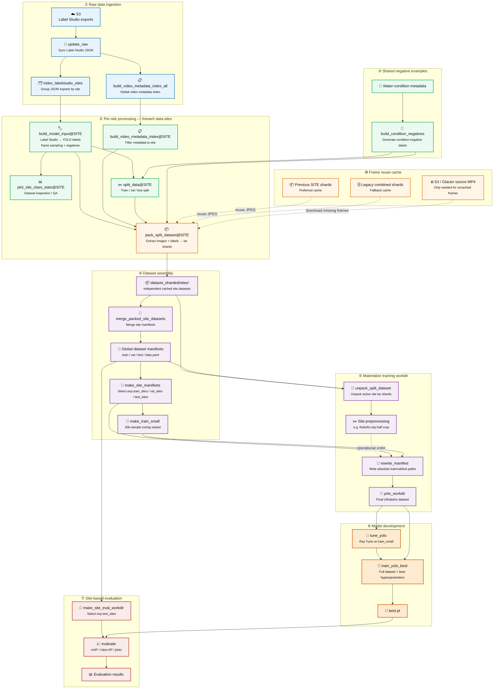

# Object Detection

Training pipeline to train the SalmonVision object detection model.

Install uv:
```bash
curl -LsSf https://astral.sh/uv/install.sh | sh
```

Install DVC with S3 support:
```bash
uv tool install "dvc[s3]"
```

Sync uv with appropriate python packages:
```bash
uv sync --extra cu124 --locked
```
Change `cu124` to `cu129` if the CUDA version is 12.9 on the system.

After this sync, remember to always either use the `--extra cu124` flag or use
`--no-sync`, so `uv` doesn't try to re-install torch with a newer version. Eg.

```bash
uv run --no-sync python
```

Install the object detection module in an editable state:
```bash
uv pip install -e .
```

### Dataset

Setup `aws` cli on the machine to point to the remote storage described in `.dvc/config`.

Run the following to pull data:
```
dvc pull
```

All the data will be downloaded to `data`.

`data/04_dataset/salmon_dataset/{sites}/dataset_sharded/` has the full dataset packed into tar shards.

The unpack step should automatically run when running later steps, but you can
manually perform run the unpack step:
 
```bash
dvc repro --single-item --force unpack_split_dataset
```

This will unpack the tar files and put them in `data/04_dataset/salmon_dataset/yolo_workdir/`

### Pipeline

Check `dvc.yaml` for the full pipeline and `params.yaml` for the inserted
parameters.

Here is a visual describing all the components:


```mermaid
flowchart TD

    %% =========================
    %% RAW DATA
    %% =========================
    subgraph RAW["① Raw data ingestion"]
        direction LR

        S3["☁️ S3<br/>Label Studio exports"]
        RAWJSON["📁 update_raw<br/><small>Sync Label Studio JSON</small>"]
        INDEX["🗂️ index_labelstudio_sites<br/><small>Group JSON exports by site</small>"]
        METAALL["📋 build_video_metadata_index_all<br/><small>Global video metadata index</small>"]

        S3 --> RAWJSON
        RAWJSON --> INDEX
        RAWJSON --> METAALL
    end


    %% =========================
    %% PER SITE
    %% =========================
    subgraph SITE["② Per-site processing — foreach data.sites"]
        direction TB

        INPUT["🏷️ build_model_input@SITE<br/><small>Label Studio → YOLO labels<br/>frame sampling + negatives</small>"]

        STATS["📊 plot_site_class_stats@SITE<br/><small>Dataset inspection / QA</small>"]

        SPLIT["✂️ split_data@SITE<br/><small>Train / val / test split</small>"]

        METASITE["📋 build_video_metadata_index@SITE<br/><small>Filter metadata to site</small>"]

        PACK["📦 pack_split_dataset@SITE<br/><small>Extract images + labels → tar shards</small>"]

        INPUT --> STATS
        INPUT --> SPLIT
        INPUT --> PACK
        METASITE --> PACK
        SPLIT --> PACK
    end


    INDEX --> INPUT
    METAALL --> METASITE


    %% =========================
    %% NEGATIVES
    %% =========================
    subgraph NEG["③ Shared negative examples"]
        direction LR

        CONDITIONS["🌊 Water-condition metadata"]
        NEGATIVE["🚫 build_condition_negatives<br/><small>Generate condition-negative labels</small>"]

        CONDITIONS --> NEGATIVE
    end

    NEGATIVE --> SPLIT
    NEGATIVE --> PACK


    %% =========================
    %% CACHE
    %% =========================
    subgraph CACHE["♻️ Frame reuse cache"]
        direction TB

        SITECACHE["📦 Previous SITE shards<br/><small>Preferred cache</small>"]
        LEGACYCACHE["🗄️ Legacy combined shards<br/><small>Fallback cache</small>"]
        GLACIER["❄️ S3 / Glacier source MP4<br/><small>Only needed for uncached frames</small>"]

        SITECACHE -. reuse JPEG .-> PACK
        LEGACYCACHE -. reuse JPEG .-> PACK
        GLACIER -. download missing frames .-> PACK
    end


    %% =========================
    %% MERGE
    %% =========================
    subgraph ASSEMBLY["④ Dataset assembly"]
        direction TB

        SITES["📦 dataset_sharded/sites/<site><br/><small>Independent cached site datasets</small>"]

        MERGE["🔀 merge_packed_site_datasets<br/><small>Merge site manifests</small>"]

        GLOBAL["📑 Global dataset manifests<br/><small>train / val / test / data.yaml</small>"]

        SITEFILTER["🎯 make_site_manifests<br/><small>Select exp.train_sites / val_sites / test_sites</small>"]

        SMALL["🧪 make_train_small<br/><small>30k-sample tuning subset</small>"]

        SITES --> MERGE
        MERGE --> GLOBAL
        GLOBAL --> SITEFILTER
        SITEFILTER --> SMALL
    end

    PACK --> SITES


    %% =========================
    %% MATERIALIZE DATASET
    %% =========================
    subgraph WORKDIR["⑤ Materialize training workdir"]
        direction TB

        UNPACK["📂 unpack_split_dataset<br/><small>Unpack active site tar shards</small>"]

        CROP["✂️ Site preprocessing<br/><small>e.g. Klukshu top-half crop</small>"]

        REWRITE["📝 rewrite_manifest<br/><small>Write absolute train/val/test paths</small>"]

        YOLODIR["📁 yolo_workdir<br/><small>Final Ultralytics dataset</small>"]

        UNPACK --> CROP
        CROP -. operational order .-> REWRITE
        REWRITE --> YOLODIR
    end

    SITES --> UNPACK
    GLOBAL --> UNPACK
    SITEFILTER --> REWRITE
    SMALL --> REWRITE


    %% =========================
    %% TRAINING
    %% =========================
    subgraph TRAINING["⑥ Model development"]
        direction LR

        TUNE["🔧 tune_yolo<br/><small>Ray Tune on train_small</small>"]

        TRAIN["🚀 train_yolo_best<br/><small>Full dataset + best hyperparameters</small>"]

        MODEL["🧠 best.pt"]

        TUNE --> TRAIN
        TRAIN --> MODEL
    end

    YOLODIR --> TUNE
    YOLODIR --> TRAIN


    %% =========================
    %% EVALUATION
    %% =========================
    subgraph EVALUATION["⑦ Site-based evaluation"]
        direction LR

        EVALSET["🎯 make_site_eval_workdir<br/><small>Select exp.test_sites</small>"]

        EVAL["📈 evaluate<br/><small>mAP / class AP / plots</small>"]

        RESULTS["📊 Evaluation results"]

        EVALSET --> EVAL
        EVAL --> RESULTS
    end

    GLOBAL --> EVALSET
    MODEL --> EVAL


    %% =========================
    %% STYLING
    %% =========================
    classDef raw fill:#e8f4fd,stroke:#2980b9,stroke-width:2px,color:#111;
    classDef site fill:#eafaf1,stroke:#27ae60,stroke-width:2px,color:#111;
    classDef cache fill:#fff4e6,stroke:#e67e22,stroke-width:2px,color:#111;
    classDef assembly fill:#f4ecf7,stroke:#8e44ad,stroke-width:2px,color:#111;
    classDef training fill:#fdebd0,stroke:#d35400,stroke-width:2px,color:#111;
    classDef eval fill:#f9ebea,stroke:#c0392b,stroke-width:2px,color:#111;

    class S3,RAWJSON,INDEX,METAALL raw;
    class INPUT,STATS,SPLIT,METASITE,NEGATIVE,CONDITIONS site;
    class PACK,SITECACHE,LEGACYCACHE,GLACIER cache;
    class SITES,MERGE,GLOBAL,SITEFILTER,SMALL,UNPACK,CROP,REWRITE,YOLODIR assembly;
    class TUNE,TRAIN,MODEL training;
    class EVALSET,EVAL,RESULTS eval;
```

Tracking metrics evaluation pipeline:

```
make_tracking_eval_set@val
make_tracking_eval_set@test
          │
          ▼
build_tracking_ground_truth@val
build_tracking_ground_truth@test
          │
          ▼
materialize_tracking_videos
          │
          ▼
run_tracker@val
          │
          ▼
evaluate_tracking@val
    HOTA
    DetA
    AssA
    MOTA
    IDF1
          │
          ▼
evaluate_counts@val
    MAE
    nMAE
    directional/species counts


                  after tracker/config selection


run_tracker@test
          │
          ▼
evaluate_tracking@test
          │
          ▼
evaluate_counts@test
```

Run the following to run the entire pipeline:
```bash
dvc repro
```

Run the following to run specific stages of the pipeline:
```bash
dvc repro stage_name
```

This will still run previous stages up to the stage specified.

For example, building the model input annotations:
```bash
dvc repro build_model_input
```

If wanting to only run one stage, use the `--single-item` flag:
```bash
dvc repro --single-item build_model_input
```

Important long-running stages include `pack_split_dataset`, `tune_yolo`, and
`train_yolo_best`. `pack_split_dataset` downloads, extracts, and packs the
video frames into tarballs, whereas the latter does hyperparameter tuning and
training. `tune_yolo` should not need to be run unless the dataset or model is
significantly different to search for new hyperparameters.

The parameters that describe the sites, paths, and training configs is in
`params.yaml`. `data.sites` params describe what data will be downloaded and
can be edited to add more sites to be extracted and packed. `exp.{set}_sites`
is where you specify the sites that will actually be used in the training,
validation, and testing. This separates the downloading and training steps to
allow site-based experimentation.

The stages are site-agnostic, meaning some stages iterate upon all the sites in
`data.sites` param and editing it to be one site or adding a new site will not
affect the data and split makeup for the other sites. You can see this in the
`foreach` line which expands the stages adding a `@site_name` for each site which
can be run manually if desired:

```
dvc repro pack_split_dataset@tankeeah
```

Stage `update_raw` is made frozen to prevent always checking the S3 for changes.
If there is an update to the JSON files exported from label studio, you can force
the stage to run:

```
dvc repro --force update_raw
```

Note that the `--force` flag will also force depended on stages to run, so also
adding `--single-item` might be a good idea for a stage in the middle of the
pipeline. For example, if you want to force re-run the packing stage due to
errors in downloading:

```
dvc repro --force --single-item pack_split_dataset
```

Run tests with
```
uv run --extra cu124 pytest
```

#### Issue: Object is of storage class GLACIER

This happens when the videos we are trying to download have been
archived into GLACIER storage. We can restore these temporarily
with the following bash script.

Capture the `repro` command into a logfile:

```
dvc repro pack_split_dataset 2>&1 | tee $(date +"pack_%Y%m%d_%H%M%S.log")
```

Submit restore requests:
```
./scripts/restore_glacier_from_log.sh request pack_xxx.log
```

By default it will be BULK (5-12 hours process) and for 3 days.

Explicitly:
```bash
./scripts/restore_glacier_from_log.sh request pack_xxx.log 3 Bulk
```

Once the requests have been sent, use the same script to check the status:

```
./scripts/restore_glacier_from_log.sh status pack_xxx.log
```

The last line should say when all the objects are ready for download.

### Plotting 

#### Frame Counts + Training Plots

All of these plots are incorporated into DVC either automatically or aggregated
through the `aggregate_site_class_stats` stage in the case of frame and box
counts.

Simply run the following after reproducing the pipeline:

```
dvc plots show
```

This creates an HTML in `dvc_plots` with the plots.

Run a simple http server and connect to it through an SSH tunnel
```bash
cd dvc_plots
python -m http.server
```

#### AP50

To evaluate over all test sites, run the following command:

```bash
uv run --extra cu124 ./scripts/run_site_eval_experiments.py --queue --run-queue
```
Replace cu124 with your appropriate CUDA version if necessary.

Add `--dry-run` to test the command first.

They can be plotted after using
```bash
./scripts/plot-all-eval.sh "Full Model AP50"
```

This creates an HTML in `dvc_plots` with the plots.

Run a simple http server and connect to it through SSH tunnel
```bash
cd dvc_plots
python -m http.server
```

#### Tracking and counting metrics

```bash
# Current workspace (single revision)
scripts/plot_species_metrics.sh val hota
scripts/plot_species_metrics.sh test idf1
scripts/plot_species_metrics.sh test count-compare
scripts/plot_species_metrics.sh test count-mae

# Compare revisions with species metrics already produced:
scripts/plot_species_metrics.sh test hota tracking-site-koeye tracking-site-tankeeah
scripts/plot_species_metrics.sh test count-compare tracking-site-koeye tracking-site-tankeeah
```

Plot types: `hota`, `idf1`, `deta`, `assa` (bounded 0–1 bars);
`count-compare` (GT vs predicted total directional events as grouped bars);
`count-mae` (MAE per video by species, nonnegative/unbounded).

### Dev

#### `run_tracking_inference` stage:

Prediction columns (`x_px`, `y_px`, `width_px`, `height_px` are **zero-based
original-image pixels**, not normalized and not cropped):

```text
split,site,video_stem,frame_idx,mot_frame,track_id,class_id,confidence,x_px,y_px,width_px,height_px
```

`frame_idx` starts at 0; `mot_frame=frame_idx+1`; track IDs are 1-based per
video. This is **not** a MOT text file. A subsequent TrackEval stage will
convert to MOT's 10-column tracker format and add 1 to the x/y origin. Frames
with no confirmed IDs have zero prediction rows; counts of untracked returned
detections are recorded separately. Track IDs are reset before every new video.

**Evaluation safety:** The status file distinguishes `ok`, `unavailable`,
`missing_local_video`, and `error`. An `ok` video with zero fish remains in the
evaluation coverage. The module fails the DVC stage for inference or local-file
errors, and rejects video/GT metadata inconsistencies larger than 1% (minimum
tolerance 2 frames); it never silently declares those sequences evaluated.
Missing/archived source videos remain explicitly excluded, not counted as
negatives. The TrackEval stage must build the seqmap only from `ok` sequences
and report the full coverage denominator.


#### `evaluate_tracking_metrics` stage:

The current upstream GT builder records observed Label Studio objects. It does
not prove that every fish was labeled throughout each entire MP4. Treat both
MOT and counting scores as **provisional**. The default `observed` scope:

* includes video iff inference completed all metadata-reported frames, GT exists,
  and GT has at least one box;
* excludes zero-GT videos unless *separately verified* as fully annotated;
* still cannot rule out missing fish in nonempty videos.

For publishable metrics, curate an independent CSV such as:

```csv
video_stem,fully_annotated
GWA-stephenssmolt-jetsonnx-0_20260507_173911_M,true
...
```

Then set `--annotation-scope verified --coverage-csv path/to/coverage.csv`
for **both** scripts. To use this through DVC, add the coverage file as a
`deps:` entry and add those CLI args in both new `cmd:` sections. A verified
empty-GT sequence is included and its tracker detections correctly become
false positives. Neither stage silently treats an unlabeled video as negative.

#### Parameters

Under `data:` in `params.yaml`:

```yaml
neg: --include-negatives
neg_ratio: 0.10
neg_per_vid: 11
neg_annotated_sites: stephenssmolt
neg_annotated_per_vid: 12
neg_exclusion_frames: 3
```

- `neg_annotated_sites`: comma-separated or space-separated **human-reviewed**
  site names. Use an empty string to disable annotated-video negatives. The
  existing empty-video sampling remains enabled by `--include-negatives`.
- `neg_annotated_per_vid`: max candidate frames from each annotated video,
  before the global negative ratio cap.
- `neg_exclusion_frames`: safety margin of **original video frames** around
  every human-annotated/interpolated frame. Does not refer to sampled stride
  positions. 0 means no margin.
- `neg_ratio`: combined cap for negatives from *both* empty and annotated
  videos, expressed as a fraction of final positive+negative labels.

The converter reuses the same frame stride and `video_hash`-based offset as
positives, so extracted frame numbers match the existing pack stage.
