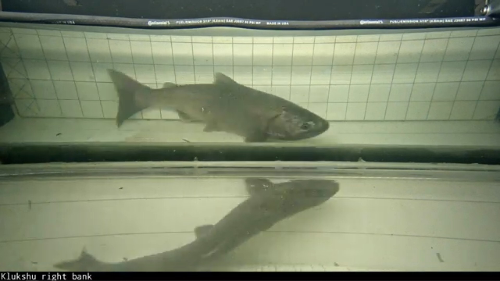

# Jetson After Cloning Setup

After cloning/imaging the disk to a different device, these are the steps to
take to set it up for either a new site or another camera of the same site.

## Table of Contents

- [Hostname](#hostname)
- [Static IP](#static-ip)
- [Healthchecks.io](#healthchecksio)
- [Mount Samba Share](#mount-samba-share)
- [Update `.env` Variables](#update-env-variables)
- [Check Drive Mount Point](#check-drive-mount-point)
- [Tests](#tests)
- [Set for production](#set-for-production)

## Hostname

```
sudo hostnamectl set-hostname ORGID-sitename-jetsonnx-0
```

- `ORGID` is the organization ID in all caps that will be provided, denoting each organization
- `sitename` is usually the river name but can be different and will also be provided
- `jetsonnx` is the device ID usually depends on the type of device. Keep this
  the same if it's the Jetson Orin NX Supers
- Increment the number if there is another camera on the same site

For example, one hostname for the Koeye river is `HIRMD-koeye-jetson-0`. This
is the hostname of the organization with the ID HIRMD for the Koeye river. This
one was a normal Jetson Nano for the first camera of the weir.

To prevent sudo warnings due to the new hostname, edit `/etc/hosts` with the
new hostname:

```
sudoedit /etc/hosts
```

Now that the hostname is changed, we need to update the Tailscale name.

Open a tmux session
```
tmux
```

Go to the jetson folder
```
cd salmon-computer-vision/utils/jetson
```

Remove the tailscale config folder
```
sudo rm -r tailscale-oauth/
```

The following ***MUST*** be run in a tmux session if you're SSHing through
tailscale. Restart the tailscale service:

```
docker compose down && docker compose up -d
```

If you are connecting to the device through tailscale, the terminal would freeze.
Open a new terminal and the device should come up as the new hostname on tailscale.

```
tailscale status
```

> 💡 It would be helpful to use some labeling tape and place it on the device
> to label it with the hostname to differentiate it visually with the other
> devices.

## Static IP

The static IP can be set in the GUI or through `nmcli` commands.

By default Starlink uses the following:
* Gateway: 192.168.1.1
* DNS: 192.168.1.1
* Netmask: 255.255.255.0 OR 24

Use the GUI Network Manager Editor:

```
sudo nm-connection-editor
```

Set the above and IP address to `192.168.1.40`

OR

These series of commands would likely work:

```bash
sudo nmcli con add con-name eth0 ifname eth0 type ethernet autoconnect yes
sudo nmcli con mod eth0 ipv4.addresses 192.168.1.40/24
sudo nmcli con mod eth0 ipv4.gateway 192.168.1.1
sudo nmcli con mod eth0 ipv4.dns 192.168.1.1,1.1.1.1
sudo nmcli con mod eth0 ipv4.method manual
sudo nmcli con up eth0
```

Usually, we standardize to `192.168.1.40` and increment by one for each new
Jetson. For example, the second Jetson would be `192.168.1.41`

Check `ifconfig` if the IP address updated.

## Healthchecks.io

This is only useful for Internet-enabled sites as we can have the device send
healthcheck pings to healthchecks.io to make sure it is still running.

First, login to [healthchecks.io](healthchecks.io) and get an invite to the
Salmon CV Project.

It is easier to duplicate one of the existing checks by clicking the three dots
on the right of one of them, going to the bottom and clicking "Create a
Copy..."

Update the name to be same as the new hostname determined above and click "Copy URL."

Login or SSH back to the Jetson and open crontab:

```
crontab -e
```

And either replace the URL or append this to the bottom, updating the URL with
what was copied:

```
* * * * * curl -fsS -m 10 --retry 5 -o /dev/null https://hc-ping.com/<ping_url>
```

This will then send a ping every minute to heatlchecks.io.

Finally, adjust the schedule on healthchecks.io to how long the
Starlink/Internet connectivity is up using cron expressions, determining which
hours the Starlink should be on. This is because most sites do not have enough
power to run Starlink for the full 24 hours, so it is usually scheduled to turn
off at certain night time hours.

## Mount Samba Share

This is only necessary if this site has more than one camera and this is the
second or above device and will not directly connect to the external
harddisk/SSD. This will mount the SSD through the local network from the device
that is connected to the external SSD.

Create a new file:
```bash
sudoedit /etc/auto_static.smb
```

with the following:
```bash
/media/hdd  -fstype=cifs,rw,guest,uid=1000,gid=1000,file_mode=0777,dir_mode=0777  ://<ip_address>/HDD
```

Replace `<ip_address>` with the static IP address of the device that is
mounting the external drive.

\[!\] Note if the device's uid/gid is different, change it the current device's
uid/gid. Run the command `id` to view. The filesystem may be slower than normal
if this is not done correctly.

Restart the autofs service:
```bash
sudo systemctl restart autofs
```

Check if it is properly mounted by listing or running `df`:
```bash
ls /media/hdd
df -h
```

## Update `.env` Variables

There are potentially 3 places with an `.env` file that might require changes
for a new site or device:
- salmon-computer-vision/utils/jetson/salmoncount/.env
- salmon-computer-vision/utils/jetson/salmonmd/.env
- salmon-computer-vision/utils/syncing/.env


`salmoncount/.env`

Only variables to potentially change is the `USERNAME` if changed on the device
and to uncomment the `FLAG` variable with the `--drop-bbox` flag only if the
target site is split between top and side views stacked in each frame as
follows:



As can be seen here, there is a top and side view of the same fish using a
mirror to do so. Setting that flag will drop the bounding boxes in the bottom
half of the frame, preventing potential overcounting.

`salmonmd/.env`

Once again `USERNAME` and also the `RTSP_URL` might need to be changed if the
IP address or RTSP URL structure is different than what is already written.

New BARLUS cameras usually have this structure:

```
RTSP_URL=rtsp://192.168.1.120/0
```

With `0` at the end denoting the main stream where you can change it to `1` for
the substream.

If possible, the camera could be accessed through HTTP to change lighting
settings resolution or FPS. BARLUS cameras have numerical presets such as 152
and 154 turn on automatic white light and infrared light sensors, respectively,
during low light.

`syncing/.env`

> 💡 The syncing services is only necessary on the first Jetson that is
> directly attached to the external HDD/SSD. Subsequent Jetsons can safely
> ignore this.

This requires changing the variables `ORGID` and `SITE_NAME` to the same
demarcation described when changing the hostname above. The only other change
is whether to point to the dev or prod buckets. Once testing is finished,
comment the dev `BUCKET` var and uncomment the prod `BUCKET`. dev and prod
buckets require different access keys, so do one final test on the prod bucket
after switching.

Using the same example for hostname above, it could look something like this:
```
USERNAME=oceanaid
DRIVE=/media/hdd
ORGID=HIRMD
SITE_NAME=koeye

# Comment if finished testing
BUCKET=dev-...

# Uncomment if set to production
#BUCKET=prod-...
```

Another part is updating the access key ID and secret for rclone to the ORGID
specific access key that we would generate for the webapp. Once you obtain the
access key ID and secret, edit `~/.config/rclone/rclone.conf` and under
`[aws]`, change the `access_key_id` and `secret_access_key` with the proper ID
and secret provided.

> 💡 Note that there might be two access keys that either only go to dev or
> only go to prod buckets.

## Check Drive Mount Point

When the external drive is plugged in, it should automatically be mounted to
`/media/hdd`. You can test hotswapping the external drive, and check `df -h` to
see if the drive is mounted at that folder.

## Tests

The typical steps to spin up the software is to go to each folder with a
`docker-compose.yml` file and run `docker compose up` on them. Doing this
without the detach flag would attach to them and output logs, so be sure to run
each `up` command in separate terminals or separate `tmux` panels (eg. CTRL+b
c).

The docker compose services are within these three folders where the `.env`
files are from above.

- salmon-computer-vision/utils/jetson/salmoncount/
- salmon-computer-vision/utils/jetson/salmonmd/
- salmon-computer-vision/utils/syncing/

`cd` to each one and run `docker compose up` to spin up the services.

If there is a camera hooked up at the `RTSP_URL` specified, the logs of all of
the devices shouldn't have any errors.

SalmonMD should show constant processing times in milliseconds and `/media/hdd`
should be populated with continuous video in the
`ORGID/sitename/device-id/cont_vids` folder.

Then, test motion detection by moving something in front of the camera, and it should
start saving a clip in `ORGID/sitename/device-id/motion_vids`.

The SalmonCount can be tested, however, it will refuse to process newly created
motion detected videos to prevent attempting to process partially saved videos.
Therefore, you would need to wait a couple of minutes after the motion detected
clip is created before testing the salmoncount. It would constantly restart
itself checking the motion detected videos for clips to process.

The syncing services are made of three different instances to in parallel
upload motion detected videos, detection text files, and count CSVs. Simply
make sure there is no errors attempting to upload the respective files in
`motion_vids`, `detections`, and `counts` folders.

> 💡 Only spin up the syncing services for the first Jetson that is directly
> attached to the external HDD/SSD.

## Set for Production

Once testing is finished, update `syncing/.env` to production by uncommenting
the prod bucket. Then, go to each folder described during testing and run

```
docker compose up -d
```

to spin up all the services in detached state.

To check the logs when they are in this detached state, go to the desired folder
and run

```
docker compose logs --tail 10 -f
```

The docker compose logs are also saved to the drive in
`/media/hdd/ORGID/sitename/device-id/logs`

Once everything seems to be running correctly, shut down the devices:
```
sudo shutdown now
```
